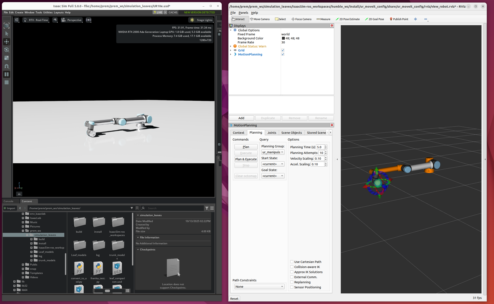
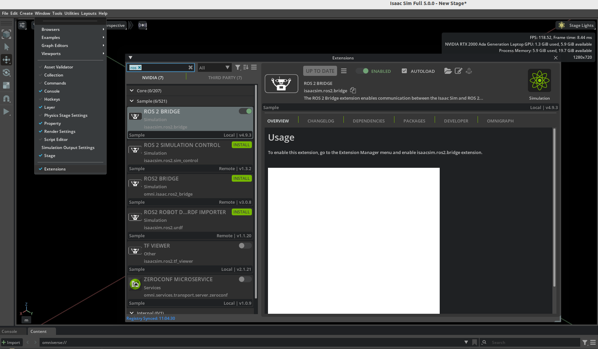

# Interfacing UR manipulator arm in Isaac sim with ROS2 and Moveit2

In this repository, I will let you go through simulating a UR10e robot in Isaac Sim and then interface it with ROS2 (Humble) and MoveIt2.  
The guidelines will help you simulate your own robot and perform the necessary customizations you need.



---

## System Setup

The following setup was tested on:
- **OS:** Ubuntu 22.04  
- **GPU:** NVIDIA (8 GB VRAM)  
- **RAM:** 32 GB  

Installed:
- **Isaac Sim 5.0.0** in a virtual environment (Python 3.11) provided by `uv` ([Installation Instruction](https://isaac-sim.github.io/IsaacLab/main/source/setup/installation/pip_installation.html))
- **ROS2 Humble** at the system level (Python 3.10) ([Installation](https://docs.ros.org/en/humble/Installation/Ubuntu-Install-Debs.html))

---

## Environment Configuration

Since Isaac Sim (Python 3.11) and ROS2 (Python 3.10) require different environments, use the following configurations:

### Isaac Sim Environment
```bash
source ~/env_isaaclab/bin/activate
export ROS_DISTRO=humble
export RMW_IMPLEMENTATION=rmw_fastrtps_cpp
export LD_LIBRARY_PATH=$LD_LIBRARY_PATH:/path_to_uv_virtual_env/env_isaaclab/lib/python3.11/site-packages/isaacsim/exts/isaacsim.ros2.bridge/humble/lib
```

you can store these command in a file_name.sh file and do:
```bash
source file_name.sh
```

### ROS:
```bash
source /opt/ros/humble/setup.bash
```

### Ros2 and isaacsim bridging:
Make sure Isaacsim has enabled ROS Bridge package (enabled by default as such). 
You can always check its status: 
Go to the extension manager menu Window > Extensions and search for ROS 2 bridge.


### Isaac_ros2_workspace:
Download the isaac_ros2 workspace from below and use its humble_ws folder as your ROS workspace (since I am using ROS2 humble)
https://github.com/isaac-sim/IsaacSim-ros_workspaces/tree/IsaacSim-5.0.0

### topic_based_ros2_control
Isaac-sim (in virtual env) and ROS (system) communicates using [topic_based_ros2_control](https://github.com/PickNikRobotics/topic_based_ros2_control) package.
Download it and move it to yout humble_ws/src folder.


### UR_ROS2 description and driver:
Download the original official drivers from below links and put them in humble_ws/src folder. You need to modify certain things to work it out with Isaac (explained later)
https://github.com/UniversalRobots/Universal_Robots_ROS2_Description
https://github.com/UniversalRobots/Universal_Robots_ROS2_Driver


### Building the humble_ws workspace:
1) cd to /humble_ws
2) rosdep install --from-paths src --ignore-src -r -y
3) colcon build --symlink-install
4) source install/setup.bash   (you need to run this each time you open a new terminal)

### Overall workflow:
1) In a terminal, start the [Isaac environment](https://github.com/praj441/Interface_UR10e_Manipulator_Isaac_ROS2_Moveit2/blob/main/README.md#isaac-sim-environment).
2) Run isaac sim and load UR10.usd from (Top-left -> Create -> Robots -> Asset Browser)
3) You need to create an ActionGrasp and configure a few things (I followed [this](https://youtu.be/pGje2slp6-s)).
4) Run the simulation in Isaac_sim and check if it publish appropiate topics (state publisher and command subscription)
5) In a separate terminal, source the ros and workspace environemnt as mentioned before
6) Launch moveit2 along with rviz, ros2_control, topi_based_ros2_control (explained next)
   ```bash
   ros2 launch ur_moveit_config ur_moveit_isaac.launch.py ur_type:=ur10e use_fake_hardware:=false launch_rviz:=true
   ```

## Customizing default Universal_Robots_ROS2_Driver
This repository is the resultant modified Universal_Robots_ROS2_Driver package. The followings things are modified in the original package.
### Moveit launch file
To understand this, refer my code as an example and observe the changes done in moveit_launch file (ur_moveit.launch.py -> [ur_moveit_isaac.launch.py](https://github.com/praj441/Interface_UR10e_Manipulator_Isaac_ROS2_Moveit2/blob/main/ur_moveit_config/launch/ur_moveit_isaac.launch.py)):

(1) [Add ros_control and related nodes](https://github.com/praj441/Interface_UR10e_Manipulator_Isaac_ROS2_Moveit2/blob/1cac8b1761db8b1842bdfb8f49f192ee4f67c4e4/ur_moveit_config/launch/ur_moveit_isaac.launch.py#L215C3-L264C6)
```bash
  ros2_control_node = Node(
        package="controller_manager",
        executable="ros2_control_node",
        parameters=[
            robot_description,                           # URDF or xacro
            PathJoinSubstitution([
                FindPackageShare("ur_moveit_config"),
                "config",
                "ros2_controllers.yaml",
            ]),
        ],
        output="screen",
    )

    joint_state_broadcaster_spawner = Node(
        package="controller_manager",
        executable="spawner",
        arguments=[
            "joint_state_broadcaster",
            "--controller-manager",
            "/controller_manager",
        ],
    )

    ur_arm_controller_spawner = Node(
        package="controller_manager",
        executable="spawner",
        arguments=["ur_arm_controller", "-c", "/controller_manager"],
    )
```

(2) [Add newly added nodes to nodes_to_start list](https://github.com/praj441/Interface_UR10e_Manipulator_Isaac_ROS2_Moveit2/blob/1cac8b1761db8b1842bdfb8f49f192ee4f67c4e4/ur_moveit_config/launch/ur_moveit_isaac.launch.py#L305C5-L305C140)
```bash
nodes_to_start = [move_group_node, rviz_node, servo_node, ros2_control_node, joint_state_broadcaster_spawner,ur_arm_controller_spawner]
```

(3) Set [use_sim_time](https://github.com/praj441/Interface_UR10e_Manipulator_Isaac_ROS2_Moveit2/blob/1cac8b1761db8b1842bdfb8f49f192ee4f67c4e4/ur_moveit_config/launch/ur_moveit_isaac.launch.py#L410C14-L410C26) to true

### ros_controller
Ensure that proper [ros controller](https://github.com/praj441/Interface_UR10e_Manipulator_Isaac_ROS2_Moveit2/blob/main/ur_moveit_config/config/ros2_controllers.yaml) are loaded and matched with [moveit_controller](https://github.com/praj441/Interface_UR10e_Manipulator_Isaac_ROS2_Moveit2/blob/main/ur_moveit_config/config/controllers.yaml).

### Adding ros2_topic_based_control plugin to [robot's xacro file](https://github.com/praj441/Interface_UR10e_Manipulator_Isaac_ROS2_Moveit2/blob/main/ur_robot_driver/urdf/ur.ros2_control.xacro)
Match the topic names here to the topic names in isaac simulator
```bash
  <hardware>
                <plugin>topic_based_ros2_control/TopicBasedSystem</plugin>
                <param name="joint_commands_topic">/joint_commands</param>
                <param name="joint_states_topic">/joint_states</param>
                <param name="trigger_joint_command_threshold">0.001</param>
                <param name="sum_wrapped_joint_states">true</param>
      </hardware>
```

### Demo
Once everythin is setup, you can test the interface by planning any random path through rviz:

